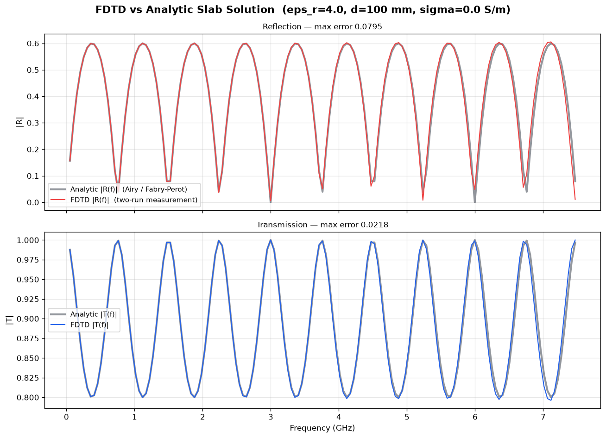

# 1-D FDTD Electromagnetic Wave Simulator

> A Python Finite-Difference Time-Domain solver for electromagnetic propagation through dielectric media, on a Yee grid — and, more to the point, a **validated** one: broadband reflection and transmission are measured from the grid and checked against the closed-form slab solution, they conserve power to 1 part in 10⁴, and the scheme converges at second order under grid refinement.

[](https://python.org)
[](https://numpy.org)
[](#running-tests)

---

## Headline Results

Default case — a 100 mm slab of ε_r = 4 (FR-4), broadband Gaussian pulse, measured over 0.05–7.47 GHz:

| Quantity | FDTD | Closed form | Error |
|:---|---:|---:|---:|
| Reflected power (band-averaged) | 20.22 % | 20.18 % | 0.04 pp |
| Transmitted power (band-averaged) | 79.78 % | 79.82 % | 0.04 pp |
| **R + T** | **100.000 %** | 100 % | **4×10⁻⁵** |
| max &#124;R(f) − R_theory(f)&#124; over the band | — | — | 0.080 |
| rms &#124;R(f) − R_theory(f)&#124; over the band | — | — | 0.021 |



The grey curve is theory, the coloured curve is the solver. The ripple is the
slab's Fabry–Perot resonance — at frequencies where the slab is an integer
number of half-wavelengths thick it becomes invisible and R drops to zero.
Reproducing that structure, rather than just an average level, is what makes
this a validation instead of a plausibility check. The visible drift above
~6 GHz is numerical dispersion: that is the edge of the band, where only 20
cells span a wavelength inside the slab.

**Grid convergence** (the Yee scheme is second order, so halving `dx` should
quarter the error):

| dx | cells | rms R error | ratio |
|---:|---:|---:|---:|
| 1.00 mm | 500 | 0.02066 | — |
| 0.50 mm | 1000 | 0.01283 | 1.61× |
| 0.25 mm | 2000 | 0.00320 | **4.01×** |

---

## How R and T Are Measured

This is the part that is easy to get wrong, so it is worth being explicit.

Reflection and transmission **cannot** be read off the final field snapshot.
By the time a run ends the pulse has largely left through the absorbing
boundaries, so "peak |Ez| still sitting to the left of the slab" decays the
longer you run — it is a function of `--steps`, not of the material.

Instead the solver runs the grid **twice**:

```
run 1 (reference) : empty grid, no slab   ->  the INCIDENT field
run 2 (total)     : same grid, with slab  ->  the TOTAL field

scattered = total - incident
```

A probe between the source and the slab records the reflected wave once the
incident field is subtracted off; a probe behind the slab records the
transmitted wave. Dividing their spectra by the incident spectrum turns one
pair of runs into a **broadband sweep**:

```
R(f) = |E_refl(f)|  / |E_inc(f)|
T(f) = |E_trans(f)| / |E_inc(f)|
```

Two guards keep the result honest. Frequencies where the incident pulse
carries under 1 % of its peak spectral amplitude are discarded (dividing by
≈0 is meaningless), and so are frequencies resolved by fewer than 20 cells per
wavelength inside the slab, where numerical dispersion rather than physics
sets the answer.

The whole measurement lives in [`scattering.py`](scattering.py).

---

## Quick Start

```bash
pip install -r requirements.txt

python fdtd_1d.py                          # default: FR-4 slab, eps_r = 4.0
python fdtd_1d.py --eps-r 7.0              # glass
python fdtd_1d.py --eps-r 4.0 --sigma 0.05 # lossy slab (R + T < 1)

python parameter_sweep.py                  # sweep eps_r, measured vs theory
python surrogate_model.py                  # ML surrogate + design search

pytest tests/ -v
```

`fdtd_1d.py` writes plots and a technical report to `results/`.

---

## Physics Implemented

Maxwell's curl equations on a staggered Yee grid, E and H offset by half a
cell and half a time step:

```
dEz/dt = (1/eps) * dHy/dx
dHy/dt = (1/mu)  * dEz/dx
```

discretised to

```
Hy[i]^{n+1/2} = Hy[i]^{n-1/2} + (dt/(mu*dx)) * (Ez[i+1]^n - Ez[i]^n)
Ez[i]^{n+1}   = Ca[i] * Ez[i]^n + Cb[i] * (Hy[i]^{n+1/2} - Hy[i-1]^{n+1/2})
```

where `Ca` and `Cb` carry the local permittivity and conductivity, so a lossy
slab absorbs and `R + T < 1`.

- **Courant condition** `S = c·dt/dx ≤ 1`, here 0.5
- **First-order Mur absorbing boundaries** — measured echo **−58 dB** on an empty grid
- **Gaussian soft source**, broadband, transparent to waves crossing it
- **Closed-form slab solution** (Airy / Fabry–Perot summation) for validation, including complex permittivity for the lossy case

---

## Parameter Sweep

`parameter_sweep.py` measures the power split across ε_r and plots it against
theory, alongside the two error checks that matter: agreement with the
closed-form solution, and R + T = 1.

```
 eps_r    R meas  R theory    T meas  T theory       R+T
   1.5    0.0205    0.0205    0.9795    0.9795   1.00000
   4.5    0.2311    0.2306    0.7689    0.7694   1.00000
   9.5    0.4165    0.4158    0.5835    0.5842   1.00000

 Worst |R_measured - R_theory| : 0.00070
 Worst |(R + T) - 1|           : 4.23e-05
```

---

## ML Surrogate Model

`surrogate_model.py` treats the solver as a data source for a design problem:
**find the slab that is most transparent at 3 GHz**, over ε_r ∈ [1.5, 10] and
thickness ∈ [40, 160] mm. Targets are measured from the grid — not taken from
a formula.

The response is genuinely two-dimensional and oscillatory, because thickness
sets the round-trip phase inside the slab. That makes feature engineering the
whole story:

| Features | Model | Held-out R² |
|:---|:---|---:|
| naive (ε_r, d) | poly-ridge (deg 3) | 0.11 |
| naive (ε_r, d) | random forest | 0.06 |
| **physics-informed** | **poly-ridge (deg 3)** | **0.9986** |
| physics-informed | random forest | 0.976 |

The physics-informed features are the refractive index `n = √ε_r` and the
round-trip phase `φ = 2·k₀·n·d`, supplied as `cos φ` and `sin φ`. Reflection
is periodic in φ, so this is the right basis; without it a low-order
polynomial cannot represent the resonance at all, and the scores say so.

Searching 100,000 candidate designs through the surrogate takes ~70 ms and
returns ε_r ≈ 5.28 at 65 mm. A confirming FDTD run measures **0.00046**
reflected power — and 65 mm is a third-order half-wave window for that index
(`3·λ₀/2n = 65.3 mm`), so the surrogate rediscovered the physics rather than
memorising the samples.

Cost per design point: **423 ms** of FDTD versus **0.69 µs** of surrogate.

---

## Project Structure

```
em-wave-simulator/
├── fdtd_1d.py           ← Yee engine, plots, technical report, CLI
├── scattering.py        ← Two-run R/T measurement + closed-form slab solution
├── parameter_sweep.py   ← Sweep eps_r; measured vs theory, with error panel
├── surrogate_model.py   ← ML surrogate on measured output + design search
├── tests/
│   └── test_fdtd.py     ← 35 pytest tests
├── results/             ← Auto-generated plots and report
│   ├── validation_spectra.png   ← FDTD vs closed form
│   ├── parameter_sweep.png
│   ├── surrogate_model.png
│   ├── wave_propagation.png
│   ├── energy_conservation.png
│   ├── material_profile.png
│   └── simulation_report.txt
├── requirements.txt
└── README.md
```

---

## Design Decisions

**Why 1-D?** It exercises the whole algorithm — Yee updates, stability,
absorbing boundaries, material interfaces, dispersion — without a mesh. The
update equations are the same in 3-D; there are just more field components.

**Why Mur ABC instead of PML?** First-order Mur is analytically derived and
short enough to read. At −58 dB it is well below the errors that matter here.
PML would be the choice if the target were −80 dB.

**Why validate against the Airy formula rather than single-interface Fresnel?**
The slab has two interfaces, and the interference between them is most of the
behaviour. A single-interface coefficient cannot be compared against a slab
measurement at all — it has no thickness in it.

**Why NumPy rather than a framework?** Writing the solver makes the numerics
inspectable, which is the point of the exercise.

---

## Corrections Made to an Earlier Version

This project was reviewed and repaired. The defects are recorded because the
fixes are most of what the code now demonstrates.

| Defect | Fix |
|:---|:---|
| **The right-hand Mur ABC was detuned into a ~90 % mirror.** `update_E` wrote `Ez[1:]`, which includes the boundary cell, so the ABC differenced a time-(n+1) value against a time-n one. The left boundary was accidentally correct because `Ez[0]` was already excluded. An empty grid returned 90 % of the pulse amplitude | Interior-only update `Ez[1:-1]`; empty-grid echo now −58 dB |
| R and T were read off the **final field snapshot**, so they decayed towards zero the longer you ran — the "measurement" was a function of `--steps` | Two-run total-field/scattered-field measurement, with a regression test that the result is unchanged from 9,000 to 15,000 steps |
| Those numbers were printed next to a **single-interface Fresnel coefficient** they could not be compared against — field vs. peak amplitude, one interface vs. two | Full Airy/Fabry–Perot slab solution; agreement checked spectrally, not just on the average |
| `c` was hard-coded to `3.0e8` while the update coefficients used exact `mu0`, `eps0` — a 0.07 % inconsistency that detunes the ABC | `C0 = 1/sqrt(mu0*eps0)`, asserted exactly in the tests |
| The surrogate model trained on `abs(R_analytical)` — a closed-form formula — while the plot labelled it "FDTD Simulation (ground truth)". Its R² measured nothing | Trains on measured FDTD output; naive vs physics-informed features compared honestly on held-out data |
| Magnetic energy was summed at n+1/2 against electric energy at n, adding a half-step sawtooth to the "energy conservation" plot | Hy time-centred by averaging across the half step |
| Tests asserted leftover numerical residue (e.g. "peak &#124;Ez&#124; > 0.01 after 1500 steps") and passed regardless of solver correctness | 35 tests covering energy conservation, spectral agreement with theory, ABC quality, run-length independence, and second-order convergence |

---

## Running Tests

```bash
pytest tests/ -v
```

```
tests/test_fdtd.py ...................................          [100%]

35 passed in 8.89s
```

Notable cases:

- `test_lossless_slab_conserves_power` — R + T = 1 for ε_r ∈ {2, 4, 9}
- `test_fdtd_matches_analytic_spectrum` — rms error vs closed form < 0.03
- `test_result_does_not_depend_on_run_length` — 9,000 vs 15,000 steps agree
- `test_second_order_convergence` — error falls > 3× per halving of `dx`
- `test_empty_grid_echo_is_small` — boundary reflection < −40 dB
- `test_half_wave_window_is_transparent` — the slab vanishes at resonance
- `test_lossy_slab_absorbs` — σ > 0 gives R + T < 1

---

## Tech Stack

| Component | Technology |
|:---|:---|
| Language | Python 3.10+ |
| Scientific computing | NumPy |
| Visualisation | Matplotlib |
| ML surrogate | scikit-learn |
| Testing | pytest (35 tests) |
| CLI | argparse (stdlib) |
